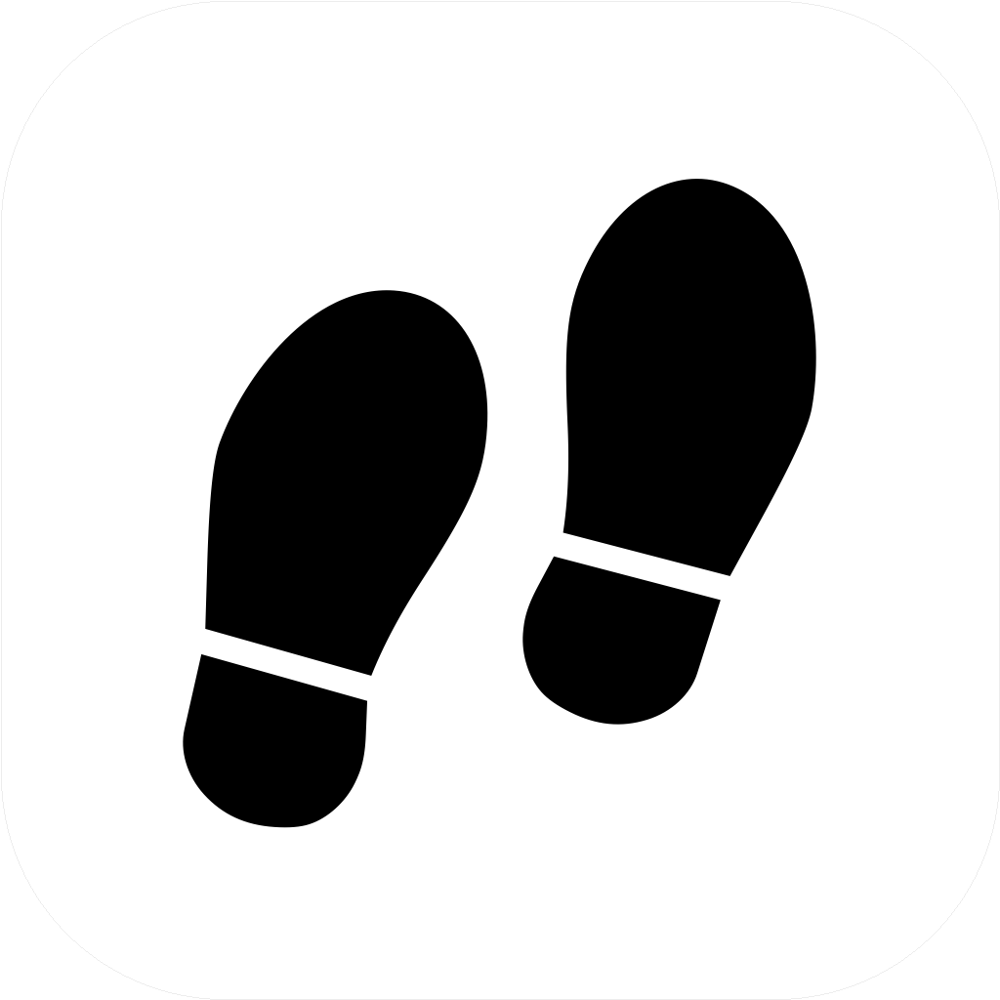

<p align="center">
  <picture>
    <source media="(prefers-color-scheme: dark)" srcset="logo-dark.png">
    
  </picture>
</p>

<h1 align="center">Footsteps</h1>

<p align="center">
  Raw location → a daily diary. Keep the evidence on your iPhone.
</p>

<p align="center">
  <a href="LICENSE"></a>
  <a href="https://developer.apple.com/ios/"></a>
  <a href="https://swift.org/"></a>
</p>

<p align="center">
  <sub>SwiftUI · SwiftData · MapKit · Swift Charts · local-first</sub>
</p>

---

Footsteps records raw Core Location observations and reconstructs your day without turning missing data into invented travel. Everything stays on-device — no account, no cloud sync.

```text
Core Location → protected SwiftData store → daily reconstruction → Path / Time
```

- **Path:** movement and stationary observations. Gaps, poor fixes and implausible jumps split routes.
- **Time:** radial heat weighted by stay duration, not sample count.
- **Day Detail:** distance, places, moving time, dwell map and moving / stationary / unknown breakdown.
- **Optional Health:** read steps on demand. Read-only; no write access.

---

### Quickstart

Requires macOS, Xcode with an iOS 17+ SDK, an Apple signing team and a physical iPhone.

```bash
git clone https://github.com/simply-sunny/footsteps.git
cd footsteps
open Footsteps.xcodeproj
```

1. Select the **Footsteps** target → **Signing & Capabilities**. Choose your team and set a unique bundle identifier.
2. Enable **Developer Mode** on your iPhone, connect it and select it as the run destination.
3. Run (`⌘R`) and allow location access. Choose **Always** and enable **Precise Location** for background recording.

---

### Know the limits

- **Battery:** navigation-grade GNSS is energy-intensive. No sub-2% battery claim.
- **Force-quit:** stops location delivery until relaunch. Unlock once after a reboot.
- **Provisioning:** free profiles expire after 7 days. Re-sign without deleting the app.
- **Portability:** no GPX/GeoJSON export yet. Preserve data before reinstalling.

---

### License

[MIT](LICENSE) · Saunak Karnati · App icon: [CC BY-SA 3.0](https://creativecommons.org/licenses/by-sa/3.0/) — see [attribution](ATTRIBUTION.md).
